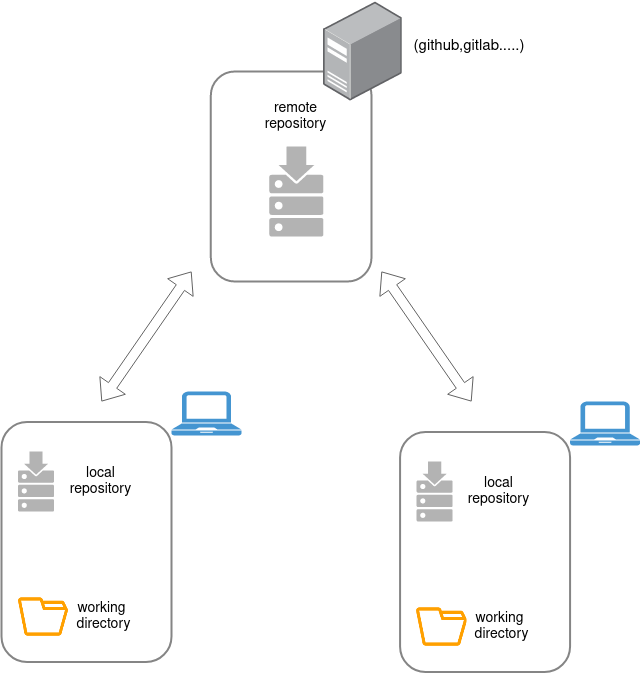
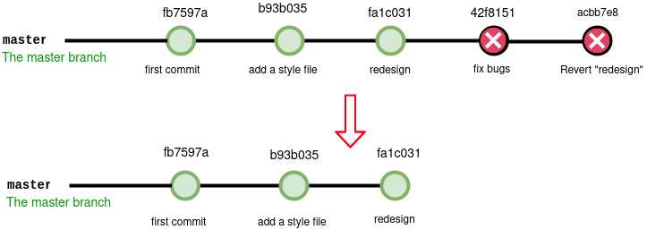
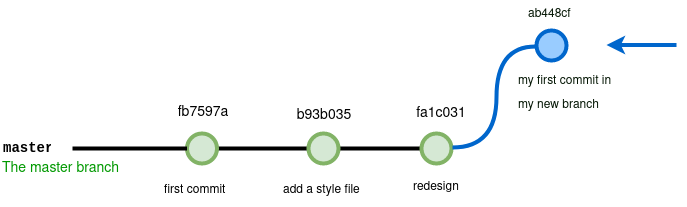
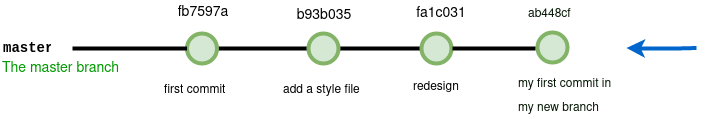

<!-- PROJECT LOGO -->
<br />
<p align="center">
  <a href="https://github.com/github_username/repo_name">
    
  </a>
  <h3 align="center">Git Session</h3>
  <p align="center">
    In this session, I will give you a tour of the important functions of Git. This tool allows you to do versioning and to keep track of the project modifications 
    <br />
    <a href="https://git-scm.com/doc"><strong>Explore the docs »</strong></a>
    <br />
    <br />
  </p>
</p>


<!-- TABLE OF CONTENTS -->
<details open="open">
	  <summary><h2 style="display: inline-block">Table of Contents</h2></summary>
  <ol>
    <li>
      <a href="#about-the-project">Git Definition</a>
      <ul>
        <li><a href="#built-with">what is git repository</a></li>
         <li><a href="#built-with">git architecture</a></li>
      </ul>
    </li>
    <li>
      <a href="#getting-started">Getting Started</a>
      <ul>
        <li><a href="#prerequisites">Init</a></li>
        <li><a href="#installation">Config</a></li>
        <li><a href="#installation">Status</a></li>
      </ul>
    </li>
     <li>
      <a href="#getting-started">Versioning</a>
      <ul>
        <li><a href="#prerequisites">Add</a></li>
        <li><a href="#installation">Commit</a></li>
        <li><a href="#installation">Log</a></li>
        <li><a href="#installation">Checkout</a></li>
        <li><a href="#installation">Revert</a></li>
        <li><a href="#installation">Reset</a></li>
      </ul>
    </li>
     <li>
      <a href="#getting-started">Branches</a>
      <ul>
        <li><a href="#prerequisites">Branch</a></li>
        <li><a href="#installation">checkout</a></li>
        <li><a href="#installation">Merge</a></li>
      </ul>
    </li>

  </ol>
</details>


<!-- ABOUT THE PROJECT -->
## Git Definition

Git is an open-source **Distributed** version control systems used for tracking project changes and revisions across different teams. 



Git saves different versions of projects in a folder known as a **Git repository**.

###  what is git repository
A Git repository is a virtual storage of your project. It allows you to save versions of your code, which you can access when needed.


 
 <!-- GETTING STARTED -->
## Git architecture


## A . Getting Started

### A.1  Iinit
  The **git init** command allows to initialize a new empty git repository. This will create a .git folder which will contain the information about our versioning.
  ```sh
cd my-project
  ```
  ```sh
git init
  ```
 

### A.2 config

Before starting to do anything it is important to configure git. By  we will have to configure the information about us. This information will be visible in the history and will allow to know later who did what.


``` sh
git config --global user.name "My_Name"
git config --global user.email "my@email.com"
.
.
```


### A.3 status
``` sh
git status
```


this command allows to get a status on the state of our history,
## B. Versioning

### B.1 git add
``` sh
git add <file-name>       //add file name to the staging area
git add  --all            //add all the files to the staging area
```
A particularity of git is its staging system which allows you to select the files to follow during the next commit. You can think of it as a "waiting area" where you list the files you want to be saved.
### B.2 git commit
``` sh
 git commit -m "message to describe your commit"
```
make a commit 
 A commit is a step in the history of your project, a step that we can identify with a particular message.
### B.3 git log
 ```
 git log
 ``` 

The log command allows us to obtain information on the different commits of our project.
 ``` sh
 git log --oneline
 ```
  allows to display the history with one line per commit 
 #### example
 > git log --oneline
 
 
> 42f8151 fix bugs
fa1c031 redesign
b93b035 add a style file
fb7597a first commit


### B.4 git checkout
``` sh
 git checkout <commit-id>
 ```
  In short you have gone back in time as a **viewer**. You can see the project as it was at the time of the commit while having the ability to return to the "present". We use this command to watch old commits,
  ##### exemple 
  > git checkout fa1c031
  
  return:
  
  >Note: switching to 'fa1c031'.
 You are in 'detached HEAD' state. You can look around, make experimental
changes and commit them, and you can discard any commits you make in this
state without impacting any branches by switching back to a branch.


``` sh
 git checkout master   //if you want to go back to the actual state

 ```

### B.5 git revert

```sh 
git revert <commit-id>
```

This command will undo what was done at the time of the commit by creating a new commit. This does ***not alter the history*** but will ***add a new reversal commit***

example:

> git revert fa1c031

result:

> Removing filee.txt
[master acbb7e8] Revert "redesign"
 1 file changed, 0 insertions(+), 0 deletions(-)
 delete mode 100644 filee.txt

 the file that i was added in the "redesign commmit" will be removed and a new commit will be created 

 

### B.6 git reset

```sh 
$ git reset 
```
Deletes all files from the staging area, without deleting the changes.

```sh 
$ git reset <commit-id>
```
* allows you to go back to the commit, 
* resets the staging area while leaving your working folder as is. The history will be lost (subsequent <commit> commits will be lost, ***but not your changes***). 

This command mostly allows you to clean up the history by resubmitting a single commit instead of too many scattered commits.

example :

 > git reset fa1c031



```sh 
$ git reset <commit-id> --hard
```

* Returns to the 'commit-id' 
* resets the staging area and working folder to match.
 All changes, as well as any commits made after the 'commit-id' will be deleted.
  **Use with extreme caution**

## C. Branches
A branch in Git is a way to keep developing and coding a new feature or modification to the software and still not affecting the main part of the project. We can also say that branches create another line of development in the project. The primary or default branch in Git is the **master** branch 

#### C.1 git branch

```sh 
git branch                     # Allows you to list the branches
git branch branch_name         # Allows you to create a new branche  branch_name 
git branch -m branch_name      # rename the current branch to  branch_name
git branch -d branch_name      # delete a branch

```

The **branch** command allows you to manage everything related to branches (adding, listing, removing, renaming)

#### C.2 git checkout
 
```sh 
git checkout branch_name                   
```
Allows you to go to an existing branch.

example:

```sh 
 git branch my_first_branch           #create my new branch
 git  checkout my_first_branch        #switch to my new branch
 
 git add .
 git commit -m "my first commit in my new branch" #add a commit in this branch

```
result:

 >Switched to branch 'my-first-branch'



#### C.3 git merge

```sh 
git merge branch_name                   
```

Merge allows you to connect two branches together and fuse them.
The fusion of two branches is always done **from the main branch**. 

example:

```sh 
git chekout master    # we must switch to the main brach
git merge my-new-branch 
                  
```


## Remote

